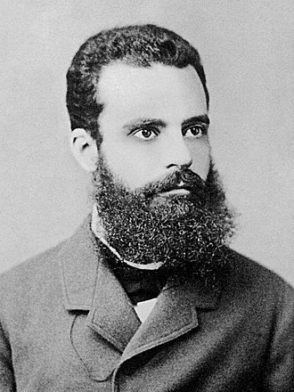

```{r setup, include=FALSE}
options(htmltools.dir.version = FALSE)
library(rPref)
library(plot3D)
library(gganimate)
library(tidyverse)
library(ggrepel)
library(DT)
library(rgl)
library(knitr)
library(rglwidget)
library(kableExtra)
library(patchwork)
library(scatterplot3d)
library(ggtext)
knit_hooks$set(webgl = hook_webgl)

Jillaroos <- read.csv("jilla.csv")
sumBowl <- read.csv("sumBowl.csv")
```

```{r xaringan-themer, include=FALSE, warning=FALSE}
library(xaringanthemer)

style_duo_accent(
  primary_color = "#c82424",
  secondary_color = "#c82424",
  inverse_header_color = "#FFFFFF",
    text_font_family = "Droid Serif",
  text_font_url = "https://fonts.googleapis.com/css?family=Droid+Serif:400,700,400italic",
  header_font_google = google_font("Yanone Kaffeesatz")
)
```

background-image: url(Capture.png)
background-position: right bottom
background-size: 220px 100px

# Thesis - Improving the Statistical Literacy of Sports Scientists

- Area 1: Mixed Models for Sports Science Research

<br>

- Area 2: Pareto Frontier Analysis for Talent Identification

<br>

- Area 3: Bayesian Inference using Subject Matter Expert Knowledge


---

background-image: url(Capture.png)
background-position: right bottom
background-size: 220px 100px

# Thesis - Improving the Statistical Literacy of Sports Scientists

- Area 1: Mixed Models for Sports Science Research

<br>

- **Area 2: Pareto Frontier Analysis for Talent Identification**

<br>

- Area 3: Bayesian Inference using Subject Matter Expert Knowledge


---
background-image: url(Capture.png)
background-position: right bottom
background-size: 220px 100px

# Talent Identification - The Issue

- Sports are multi-faceted, requiring different combinations of skills and attributes


- Team sports require athletes with a certain balance of these skills and attributes


- Typical talent identification methods look at metrics in isolation without considering the blend of these skills and attributes

- Examples:

  Field Sports: Speed & Endurance

  Tennis/Golf: Accuracy & Speed/Distance

  Rugby Codes: Tackles & Hit Ups


---
background-image: url(Capture.png)
background-position: right bottom
background-size: 220px 100px

# The solution?

--


.center[
<br>
<br>
<br>
# Pareto Frontiers!

]

---
background-image: url(Capture.png)
background-position: right bottom
background-size: 220px 100px

# Who's Pareto?


.pull-left[ **Vilfredo Pareto** was an Italian late 19th/early 20th century economist

- instrumental in understanding distribution of wealth

- developed welfare economics and game theory

- also got a solid beard
]

.pull-right[
.center[
```{r, echo = F, out.height=300, out.width= 250}

```

]]


---
background-image: url(Capture.png)
background-position: right bottom
background-size: 220px 100px

# The Pareto Frontier
- The **Pareto Frontier** (also known as multi-objective optimisation) represents the individuals where no one can be better off in one attribute without making at least one attribute worse off

--
<br>

.center[
```{r, echo = F, out.height=400, out.width= 400}
knitr::include_graphics("Pareto Example.png")
```
]

---
background-image: url(Capture.png)
background-position: right bottom
background-size: 220px 100px

# Where else have they been used before?


- **Aerodynamics**: weight (min), aerodynamic efficiency (max), and mission range (max) (Mastroddi et al., 2013)


--

<br>

- **Design of Marine Protected Area Networks**: network quality (max), population persistence (max), and cost of protection (min) (Fox et al., 2019)

<br>
--

- **Genomics**: different contrasts (max) (Hero et al., 2003)


---
background-image: url(Capture.png)
background-position: right top
background-size: 220px 100px

# Pareto Example - NRL
```{r echo=F, message=FALSE, warning=FALSE, fig.retina=5, fig.width=9}
allmatchstats <- read.csv('allmatchstats.csv') %>% filter(Season == 2020)
allmatchstats <- allmatchstats[as.numeric(rownames(allmatchstats)) %% 10 == 0,]
listPareto <- psel(allmatchstats,high(Tackles)*high(All_Run_Metres))
listPareto <- listPareto %>%
  select(Player, Game,Round,Season, Tackles, All_Run_Metres)
playerlist <- listPareto %>%
  select(Player, Game,Round,Season)
playerlist$Pareto <- paste0(playerlist$Player, ", Rd ",playerlist$Round)
a <- left_join(allmatchstats, playerlist)
na <- a[is.na(a$Pareto),]
pareto <- a[!is.na(a$Pareto),]
ggplot(a, aes(x = Tackles, y = All_Run_Metres)) +
  geom_point(alpha=0.25, size = 3) +
  theme_minimal()  +
  geom_hline(yintercept = 0, size = 1, colour="#333333") +
  labs(title="The balance between tackles and run metres in 2020 NRL matches",
       x = "Tackles",
       y = "Running Metres")+
  theme(axis.title = element_text(size = 22),
        axis.text = element_text(size = 16),
        title = element_text(size = 16))
```
---
background-image: url(Capture.png)
background-position: right top
background-size: 220px 100px

# Pareto Example - NRL

```{r echo=F, message=FALSE, warning=FALSE, fig.retina=5, fig.width=9}
ggplot(na, aes(x = Tackles, y = All_Run_Metres)) +
  geom_point(alpha=0.25, size = 3) +
  geom_point(data = pareto, aes(x = Tackles, y = All_Run_Metres), alpha = 0.25, colour = "red", size = 3)+
  geom_line(data = pareto, aes(x = Tackles, y = All_Run_Metres), alpha = 0.25, colour = "red")+
  theme_minimal()  +
  geom_hline(yintercept = 0, size = 1, colour="#333333") +
  labs(title="The balance between tackles and run metres in 2020 NRL matches",
       x = "Tackles",
       y = "Running Metres") +
  theme(axis.title = element_text(size = 22),
        axis.text = element_text(size = 16),
        title = element_text(size = 16))
```
---
background-image: url(Capture.png)
background-position: right top
background-size: 220px 100px

# Pareto Example - NRL

```{r echo=F, message=FALSE, warning=FALSE, fig.retina=5, fig.width=9}
ggplot(na, aes(x = Tackles, y = All_Run_Metres)) +
  geom_point(alpha=0.25, size = 3) +
  geom_point(data = pareto, aes(x = Tackles, y = All_Run_Metres), alpha = 0.25, colour = "red", size = 3)+
  geom_text_repel(data = pareto, aes(x = Tackles, y = All_Run_Metres, label = Pareto))+
  geom_line(data = pareto, aes(x = Tackles, y = All_Run_Metres), alpha = 0.25, colour = "red")+
  theme_minimal()  +
  geom_hline(yintercept = 0, size = 1, colour="#333333") +
  labs(title="The balance between tackles and run metres in 2020 NRL matches",
       x = "Tackles",
       y = "Running Metres") +
  theme(axis.title = element_text(size = 22),
        axis.text = element_text(size = 16),
        title = element_text(size = 16))
```

---
background-image: url(Capture.png)
background-position: right top
background-size: 220px 100px

# Pareto Example - Tennis Serving

```{r echo=F, message=FALSE, warning=FALSE, fig.retina=5, fig.width=9}
df <- read.csv("WTA Player Results.csv")
df <- df %>%
  mutate(
    FirstServePercent = X1st_serve_in/service_points*100,
    FirstServeWonPercent = X1st_serve_won/X1st_serve_in*100,
    AcePercent = aces/service_points,
  )
df <- df %>%
  group_by(name) %>%
  summarise(fsp = mean(FirstServePercent, na.rm = T),
            fswp = mean(FirstServeWonPercent, na.rm = T),
            ap = mean(AcePercent,na.rm = T),
            n = n()) %>%
  filter(n > 20)
b <- psel(df, high(fsp)*high(fswp), top_level = 1)
ggplot() +
  geom_point(data = df, mapping = aes(x = fsp, y = fswp), alpha = 0.1, size = 3) +
  theme_minimal()+
  labs(x = "First Serve Accuracy (%)",
       y = "First Serve Win (%)")+
  theme(legend.position = "none")+
  theme(axis.title = element_text(size = 20),
        axis.text = element_text(size = 16))

```

---

background-image: url(Capture.png)
background-position: right top
background-size: 220px 100px

# Pareto Example - Tennis Serving

```{r echo=F, message=FALSE, warning=FALSE, fig.retina=10, fig.width=9}
ggplot() +
  geom_point(data = df, mapping = aes(x = fsp, y = fswp), alpha = 0.1, size = 3) +
  geom_point(data = b, mapping = aes(x = fsp, y = fswp),alpha = 0.25,size = 3, colour = "red") +
  geom_step(data = b, mapping = aes(x = fsp, y = fswp),direction = "vh", colour = "red") +
  theme_minimal()+
  labs(x = "First Serve Accuracy (%)",
       y = "First Serve Win (%)")+
  theme(legend.position = "none")+
  theme(axis.title = element_text(size = 20),
        axis.text = element_text(size = 16))

```
---

background-image: url(Capture.png)
background-position: right top
background-size: 220px 100px

# Pareto Example - Tennis Serving

```{r echo=F, message=FALSE, warning=FALSE, fig.retina=10, fig.width=9}
ggplot() +
  geom_point(data = df, mapping = aes(x = fsp, y = fswp), alpha = 0.1, size = 3) +
  geom_point(data = b, mapping = aes(x = fsp, y = fswp), alpha = 0.25, size = 3, colour = "red") +
  geom_text_repel(aes(fsp, fswp, label = name), data = b %>% filter(.level == 1)) +
  geom_step(data = b, mapping = aes(x = fsp, y = fswp),direction = "vh", alpha = 0.25, colour = "red") +
  theme_minimal()+
  labs(x = "First Serve Accuracy (%)",
       y = "First Serve Win (%)")+
  theme(legend.position = "none")+
  theme(axis.title = element_text(size = 20),
        axis.text = element_text(size = 16))

```
---
background-image: url(Capture.png)
background-position: right top
background-size: 220px 100px

# Research Question

**Problem:** In Twenty20 cricket, batters are required to score as many runs as they can and as fast as they can. Similarly, bowlers also need to take as many wickets as possible, but also concede as few runs as possible.

--

<br> 

**Research Q:** How can we visualise the best batters and bowlers in Big Bash cricket?

---
background-image: url(Capture.png)
background-position: right top
background-size: 220px 100px

# Univariate Analysis

```{r echo=F, message=FALSE, warning=FALSE, fig.retina=7, fig.width=12}
MenBatCar <- read.csv("MenBatCar.csv")
datatable(MenBatCar %>% 
            mutate(across(c(Average,StrikeRate),round, digits = 1)) %>%
            select(Batter,Average, `Strike Rate` = StrikeRate) %>%
            arrange(Batter),
          options = list(dom = "t"))
  
```

---
background-image: url(Capture.png)
background-position: right top
background-size: 220px 100px

# Career Batting Frontier

.center[
```{r echo=F, message=FALSE, warning=FALSE, fig.retina=7, fig.width=9}
MenBatCar <- read.csv("MenBatCar.csv")
ggplot(MenBatCar, aes(x = Average, y = StrikeRate)) +
  geom_point(aes(color=as.factor(ParetoLevel)) , alpha = 0.7, size = 3) +
  scale_color_manual(values = c("red","black"))+
  geom_line(data = MenBatCar %>% filter(ParetoLevel == 1), aes(x = Average, y = StrikeRate), colour = "red")+
  geom_text_repel(data = MenBatCar %>% filter(ParetoLevel == 1), aes(x = Average, y = StrikeRate, label = Pareto), colour = "red")+
  theme_minimal()  +
  labs(title = "Men's Career Batting Pareto Frontier",
       x = "Career Batting Average",
       y = "Career Batting Strike Rate") +
  theme(axis.title = element_text(size = 16),
        legend.position = "none",
        axis.text = element_text(size = 16, color = "black"))

```
]
---
background-image: url(Capture.png)
background-position: right top
background-size: 220px 100px

# Career Batting Frontier

.center[
```{r echo=F, message=FALSE, warning=FALSE, fig.retina=7, fig.width=9}
WomenBatCar <- read.csv("WomenBatCar.csv")
ggplot(WomenBatCar, aes(x = Average, y = StrikeRate)) +
  geom_point(aes(color=as.factor(ParetoLevel)) , alpha = 0.7, size = 3) +
  scale_color_manual(values = c("red","black"))+
  geom_line(data = WomenBatCar %>% filter(ParetoLevel == 1), aes(x = Average, y = StrikeRate), colour = "red")+
  geom_text_repel(data = WomenBatCar %>% filter(ParetoLevel == 1), aes(x = Average, y = StrikeRate, label = Pareto), colour = "red")+
  theme_minimal()  +
  labs(title = "Women's Career Batting Pareto Frontier",
       x = "Career Batting Average",
       y = "Career Batting Strike Rate") +
  theme(axis.title = element_text(size = 16),
        legend.position = "none",
        axis.text = element_text(size = 16, color = "black"))
```
]


---
background-image: url(Capture.png)
background-position: right top
background-size: 220px 100px

# Innings Batting Frontier
```{r echo=F, message=FALSE, warning=FALSE, fig.retina=7, fig.width=12}
a <- read.csv('MenBatInn.csv')
na <- a[is.na(a$Pareto),]
pareto <- a[!is.na(a$Pareto),]
MenBatInn <- ggplot(na %>%  filter(R > 50 | SR > 100), aes(x = R, y = SR)) +
  geom_point(alpha=0.05, size = 3) +
  geom_point(data = pareto, aes(x = R, y = SR), alpha = 0.7, shape = 21, size = 3, fill = "red", color = "red")+
  geom_text_repel(data = pareto, aes(x = R, y = SR, label = Pareto), color = "Red")+
  geom_line(data = pareto, aes(x = R, y = SR), alpha = 0.5, colour = "red")+
  scale_y_continuous(breaks = c(100,200,300,400,500,600))+
  theme_minimal()  +
  labs(title = "Men's Innings Batting Pareto Frontier",
       x = "Runs Scored in an Innings",
       y = "Innings Batting Strike Rate") +
  theme(axis.title = element_text(size = 16),
        panel.grid.minor.y = element_blank(),
        axis.text = element_text(size = 16, color = "black"))
a2 <- read.csv('WomenBatInn.csv')
na2 <- a2[is.na(a2$Pareto),]
pareto2 <- a2[!is.na(a2$Pareto),]
WomenBatInn <- ggplot(na2 %>%  filter(R > 50 | SR > 100), aes(x = R, y = SR)) +
    geom_point(alpha=0.05, size = 3) +
    geom_point(data = pareto2, aes(x = R, y = SR), alpha = 0.7, shape = 21, size = 3, fill = "red", color = "red")+
    geom_text_repel(data = pareto2, aes(x = R, y = SR, label = Pareto), color = "Red")+
    geom_line(data = pareto2, aes(x = R, y = SR), alpha = 0.5, colour = "red")+
  scale_y_continuous(breaks = c(100,200,300,400,500,600))+
  theme_minimal()  +
  labs(title = "Women's Innings Batting Pareto Frontier",
       x = "Runs scored in an innings",
       y = "Innings Batting Strike Rate") +
  theme(axis.title = element_text(size = 16),
        panel.grid.minor.y = element_blank(),
        axis.text = element_text(size = 16, color = "black"))
MenBatInn + WomenBatInn
```

---
background-image: url(Capture.png)
background-position: right top
background-size: 220px 100px

# Innings Bowling Frontier
```{r echo=F, message=FALSE, warning=FALSE, fig.retina=7, fig.width=12}
a3 <- read.csv("MenBowlInn.csv")
na3 <- a3[is.na(a3$Pareto),]
pareto3 <- a3[!is.na(a3$Pareto),]
a4 <- read.csv("WomenBowlInn.csv")
na4 <- a4[is.na(a4$Pareto),]
pareto4 <- a4[!is.na(a4$Pareto),]
MenBowlInnPlot <- ggplot(na3, aes(x = W, y = Econ)) +
  geom_jitter(alpha=0.1, size = 3, width = 0.1) +
  geom_point(data = pareto3, aes(x = W, y = Econ), alpha = 0.7, shape = 21, size = 3, fill = "red", color = "red")+
  geom_text_repel(data = pareto3, aes(x = W, y = Econ, label = Pareto), color = "Red")+
  geom_line(data = pareto3, aes(x = W, y = Econ), alpha = 0.5, colour = "red")+
  theme_minimal() +
  labs(title = "Men's Innings Bowling Pareto Frontier",
       x = "Wickets in an innings",
       y = "Innings Bowling Economy") +
  theme(axis.title = element_text(size = 16),
        panel.grid.minor.y = element_blank(),
        axis.text = element_text(size = 16, color = "black"))
WomenBowlInnPlot <- ggplot(na4, aes(x = W, y = Econ)) +
  geom_jitter(alpha=0.1, size = 3, width = 0.1) +
  geom_point(data = pareto4, aes(x = W, y = Econ), alpha = 0.7, shape = 21, size = 3, fill = "red", color = "red")+
  geom_text_repel(data = pareto4, aes(x = W, y = Econ, label = Pareto), color = "Red")+
  geom_line(data = pareto4, aes(x = W, y = Econ), alpha = 0.5, colour = "red")+
  theme_minimal() +
  labs(title = "Women's Innings Bowling Pareto Frontier",
       x = "Wickets in an innings",
       y = "Innings Bowling Economy") +
  theme(axis.title = element_text(size = 16),
        panel.grid.minor.y = element_blank(),
        axis.text = element_text(size = 16, color = "black"))
MenBowlInnPlot + WomenBowlInnPlot
```
---
background-image: url(Capture.png)
background-position: right top
background-size: 220px 100px

# Men's Career Bowling Frontier
```{r echo=F, message=FALSE, warning=FALSE, fig.retina=7, fig.width=12}
MenBowlCar <- read.csv("MenBowlCar.csv")
colors <- c("#999999", "#E69F00")
MenBowlCar <- MenBowlCar %>% 
  mutate(colors = case_when(is.na(Pareto) ~ 1,
                            is.character(Pareto) ~ 2))
colors <- MenBowlCar$colors
scatterplot3d(MenBowlCar[c(7,6,8)], type = "h",pch = 16, color=colors,
                                  xlab="Career Bowling Economy",
                                  ylab="Career Bowling Strike Rate",
                                  zlab="Career Bowling Average")
```
---
background-image: url(Capture.png)
background-position: right top
background-size: 220px 100px

# Women's Career Bowling Frontier

```{r echo=F, message=FALSE, warning=FALSE, fig.retina=7, fig.width=12}
WomenBowlCar <- read.csv("WomenBowlCar.csv")
colors <- c("#999999", "#E69F00")
WomenBowlCar <- WomenBowlCar %>% 
  mutate(colors = case_when(is.na(Pareto) ~ 1,
                            is.character(Pareto) ~ 2))
colors <- WomenBowlCar$colors
scatterplot3d(WomenBowlCar[c(7,6,8)], type = "h",pch = 16, color=colors,
                                  xlab="Career Bowling Economy",
                                  ylab="Career Bowling Strike Rate",
                                  zlab="Career Bowling Average")

```

---
background-image: url(Capture.png)
background-position: right top
background-size: 220px 100px


# Other Examples - Speed v Endurance
.center[
```{r echo=F, message=FALSE, warning=FALSE, fig.retina=10, fig.width=6}
v <- psel(Jillaroos %>% filter(X30.15 > 16 & X20m < 3.34), high(X30.15)*low(X20m), top_level = 15)
w <- v %>% filter(.level == 1)
ggplot(v)+
  geom_point(mapping = aes(x=X30.15, y=X20m),alpha = 0.3, size = 3) +
  geom_point(data = w, mapping = aes(x=X30.15, y=X20m),color = "red", alpha = 0.3, size = 3) +
  geom_line(data = w, mapping = aes(x=X30.15, y=X20m),color = "red",alpha = 0.3, size = 3) +
  theme_minimal() +
  labs(x = "30-15 IFT",
    y = "20 metre Sprint") +
  theme(legend.position = "none",
        axis.title = element_text(size = 20),
        axis.text = element_text(size = 16))
```
]

---
background-image: url(Capture.png)
background-position: right top
background-size: 220px 100px


# Other Examples - Speed v Endurance
.center[
```{r echo=F, message=FALSE, warning=FALSE, fig.retina=7, fig.width=6}
a <- read.csv("a.csv")
b <- a %>% filter(.level < 2)
cols <- c("1" = "#c71e1d", "2" = "#09bb9f", "3" = "#1d81a2")
ggplot(b)+
   geom_point(data = a, aes(y=R30, x=R10m, group = as.factor(.level)), color = "grey", alpha = 0.7, size = 2) +
  geom_point(mapping = aes(y=R30, x=R10m),shape = 21, fill = "black",color = "white",alpha = 0.2, size = 2) +
  geom_line(data = b,aes(y=R30, x=R10m, group = as.factor(.level), color = as.factor(.level)), size = 1)+
  scale_color_manual(values = cols) +
  theme_minimal()+
  labs(y = "Speed - Rolling 30-sec average distance (m/min)",
       x = "Endurance - Rolling 10-min average distance (m/min)")+
  theme(legend.position = "none",
        plot.title = element_text(size = 14),
        panel.background = element_blank(),
        plot.background = element_blank())
```
]
---
background-image: url(Capture.png)
background-position: right top
background-size: 220px 100px


# Visualising Further Frontiers
.center[
```{r echo=F, message=FALSE, warning=FALSE, fig.retina=7, fig.width=6}
b <- a %>% filter(.level < 3)
cols <- c("1" = "#c71e1d", "2" = "#09bb9f", "3" = "#1d81a2")
ggplot(b)+
   geom_point(data = a, aes(y=R30, x=R10m, group = as.factor(.level)), color = "grey", alpha = 0.7, size = 2) +
  geom_point(mapping = aes(y=R30, x=R10m),shape = 21, fill = "black",color = "white",alpha = 0.2, size = 2) +
  geom_line(data = b,aes(y=R30, x=R10m, group = as.factor(.level), color = as.factor(.level)), size = 1)+
  scale_color_manual(values = cols) +
  theme_minimal()+
  labs(y = "Speed - Rolling 30-sec average distance (m/min)",
       x = "Endurance - Rolling 10-min average distance (m/min)")+
  theme(legend.position = "none",
        plot.title = element_text(size = 14),
        panel.background = element_blank(),
        plot.background = element_blank())
```
]

---
background-image: url(Capture.png)
background-position: right top
background-size: 220px 100px


# Visualising Further Frontiers

.center[
```{r echo=F, message=FALSE, warning=FALSE, fig.retina=7, fig.width=6}
b <- a %>% filter(.level < 4)
cols <- c("1" = "#c71e1d", "2" = "#09bb9f", "3" = "#1d81a2")
ggplot(b)+
   geom_point(data = a, aes(y=R30, x=R10m, group = as.factor(.level)), color = "grey", alpha = 0.7, size = 2) +
  geom_point(mapping = aes(y=R30, x=R10m),shape = 21, fill = "black",color = "white",alpha = 0.2, size = 2) +
  geom_line(data = b,aes(y=R30, x=R10m, group = as.factor(.level), color = as.factor(.level)), size = 1)+
  scale_color_manual(values = cols) +
  theme_minimal()+
  labs(y = "Speed - Rolling 30-sec average distance (m/min)",
       x = "Endurance - Rolling 10-min average distance (m/min)")+
  theme(legend.position = "none",
        plot.title = element_text(size = 14),
        panel.background = element_blank(),
        plot.background = element_blank())
```
]

---
background-image: url(Capture.png)
background-position: right top
background-size: 220px 100px

# Interactive 3D Frontiers

.center[

```{r echo=F, message=FALSE, warning=FALSE, webgl=TRUE, fig.retina=10, fig.width=7,fig.height=7}
MenBowlCar <- psel(MenBowlCar,low(StrikeRate)*low(Economy)*low(Average),top_level = 50) 
plot3d(MenBowlCar$StrikeRate,MenBowlCar$Economy,MenBowlCar$Average, col = MenBowlCar$.level, colvar = NULL,  type = "h", ticktype = "detailed",
       colkey = list(at = c(1:32), side = 1, addlines = TRUE, length = 0.5, width = 0.5),
       xlab ="Strike Rate", ylab ="Economy", zlab = "Average")
```
]
---
background-image: url(Capture.png)
background-position: right top
background-size: 220px 100px

# Expanding the Statistical Literature

```{r echo=F, message=FALSE, warning=FALSE, fig.retina=7, fig.width=9}
b <- df[as.numeric(rownames(df)) %% 10 == 0,] %>% filter(fsp > 0.55)
c <- psel(b, high(fsp)*high(fswp))
ggplot(b, aes(x = fsp, y = fswp)) +
  geom_pointrange(mapping = aes(xmin=fsp-fsp/100, xmax=fsp+fsp/100),alpha = 0.3)+
  geom_pointrange(mapping = aes(ymin=fswp-fswp/50, ymax=fswp+fswp/50), alpha = 0.3) +
  geom_point(alpha = 0.7, size = 3) +
  geom_step(data = c, mapping = aes(x = fsp, y = fswp),direction = "vh", alpha = 0.25, colour = "red", size = 2) +
  theme_minimal()+
  labs(x = "First Serve Accuracy (%)",
       y = "First Serve Win (%)")+
  theme(legend.position = "none")+
  theme(axis.title = element_text(size = 20),
        axis.text = element_text(size = 16))

```
---
background-image: url(Capture.png)
background-position: right top
background-size: 220px 100px

# Practical Applications

```{r echo=F, message=FALSE, warning=FALSE, fig.retina=7, fig.width=9}
b <- psel(df, high(fsp)*high(fswp), top_level = 1)
ggplot(b, aes(x = fsp, y = fswp)) +
  geom_point(alpha = 0.7, size = 3, colour = "red") +
  geom_step(data = b, mapping = aes(x = fsp, y = fswp),direction = "vh", alpha = 0.25, colour = "red") +
  geom_point(aes(x = 64, y = 64), size = 5) +
  annotate("text", x = 64, y = 63, label = "Your Athlete")+
  geom_segment(aes(x = 64, y = 64, xend = 68, yend = 64),
                  arrow = arrow(length = unit(0.5, "cm"))) +
  theme_minimal()+
  labs(x = "First Serve Accuracy (%)",
       y = "First Serve Win (%)")+
  theme(legend.position = "none")+
  theme(axis.title = element_text(size = 20),
        axis.text = element_text(size = 16))

```
---
background-image: url(Capture.png)
background-position: right top
background-size: 220px 100px

# Practical Applications

```{r echo=F, message=FALSE, warning=FALSE, fig.retina=7, fig.width=9}
b <- psel(df, high(fsp)*high(fswp), top_level = 1)
ggplot(b, aes(x = fsp, y = fswp)) +
  geom_point(alpha = 0.7, size = 3, colour = "red") +
  geom_step(data = b, mapping = aes(x = fsp, y = fswp),direction = "vh", alpha = 0.25, colour = "red") +
  geom_point(aes(x = 64, y = 64), size = 5) +
  annotate("text", x = 64, y = 63, label = "Your Athlete")+
  geom_segment(aes(x = 64, y = 64, xend = 64, yend = 69),
                  arrow = arrow(length = unit(0.5, "cm"))) +
  theme_minimal()+
  labs(x = "First Serve Accuracy (%)",
       y = "First Serve Win (%)")+
  theme(legend.position = "none")+
  theme(axis.title = element_text(size = 20),
        axis.text = element_text(size = 16))

```
---
background-image: url(Capture.png)
background-position: right top
background-size: 220px 100px

# Practical Applications

```{r echo=F, message=FALSE, warning=FALSE, fig.retina=7, fig.width=9}
ggplot(b, aes(x = fsp, y = fswp)) +
  geom_point(alpha = 0.7, size = 3, colour = "red") +
  geom_step(data = b, mapping = aes(x = fsp, y = fswp),direction = "vh", alpha = 0.25, colour = "red") +
  geom_point(aes(x = 64, y = 64), size = 5) +
  annotate("text", x = 64, y = 63, label = "Your Athlete")+
  geom_segment(aes(x = 64, y = 64, xend = 67, yend = 67),
                  arrow = arrow(length = unit(0.5, "cm"))) +
  theme_minimal()+
  labs(x = "First Serve Accuracy (%)",
       y = "First Serve Win (%)")+
  theme(legend.position = "none")+
  theme(axis.title = element_text(size = 20),
        axis.text = element_text(size = 16))

```

---
background-image: url(Capture.png)
background-position: right top
background-size: 220px 100px

# How can you use Pareto frontiers?

- Coaches

- High-Performance Staff

- Injury Prevention and Rehab

---
class: center, middle, inverse

# Thanks!

---
class: center, middle, inverse

# Demo

## pointninefour.shinyapps.io/SPIKEDemo


